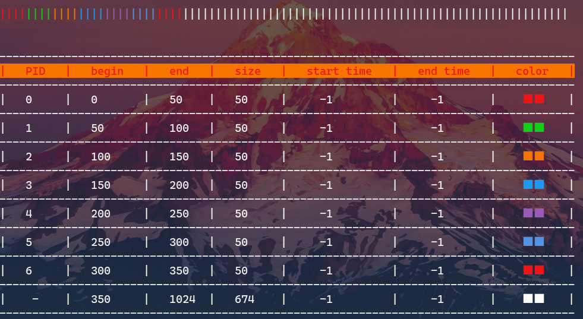
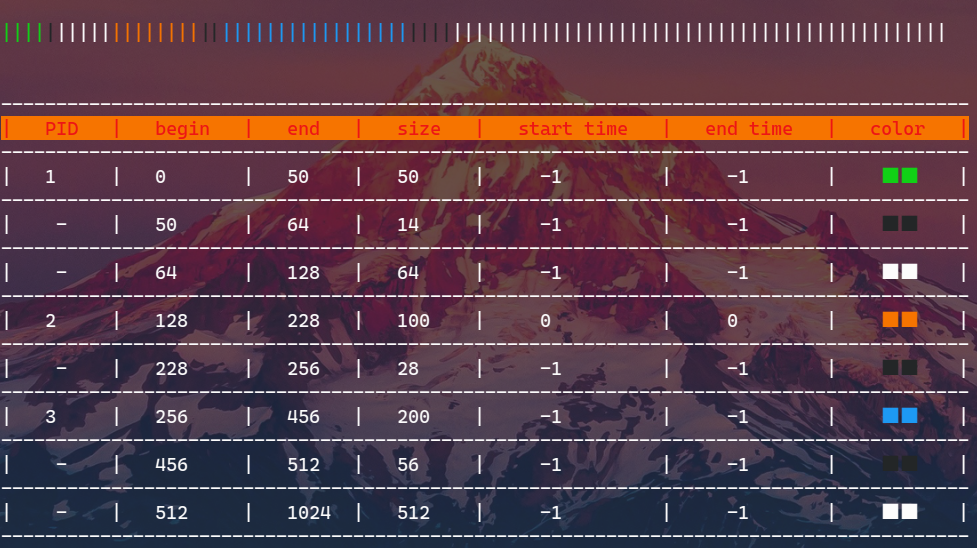
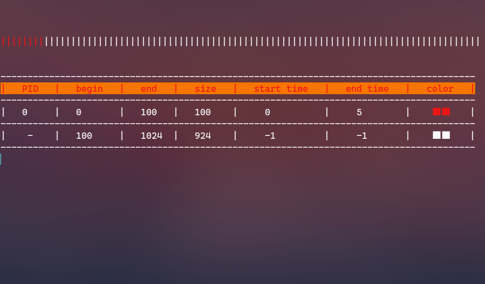

 

# MemAlloc

A **visualization tool** for memory allocation with a **dirty implementation**, including *first-fit*, *best-fit*, *worst-fit*, *next-fit* and *buddy algorithm*.

~~This is my first C project.~~

## Overview

For the first four algorithms, use `white` color for spare memory block, and other 6 color depends on PID:



For buddy algorithm, use `black` color representing those spare block which can not be allocated:



And furthermore memalloc also support to emulate process allocation and free, within a specified time span:



## Usage

```bash
sh build.sh && ./build/memalloc
```

## TODO

- [ ] Fix bug of buddy algorithm
- [ ] Imporve interaction and interface
- [ ] More efficient maybe
- [ ] Refactor by C++
- [ ] Compile and run on Windows
